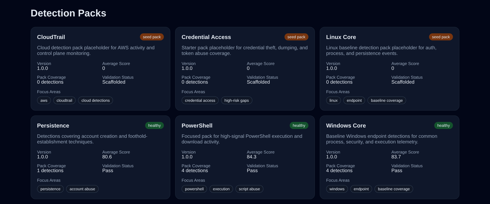

# DetLab

Detection-First Visual Detection Engineering, Threat Hunting & DFIR Platform

Build, validate, score, convert, test, and visually explore detections from a single platform.

DetLab is built for detection engineers, threat hunters, SOC analysts, DFIR analysts, and security engineers who want a practical way to improve a detection library without standing up a heavy governance platform.

## Why DetLab

Most detection teams still piece together validation, ATT&CK mapping, backend conversion, scoring, and reporting with ad hoc scripts and spreadsheets.

That creates slow feedback loops:
- detections get written but not validated consistently
- ATT&CK coverage is hard to explain quickly
- backend conversion becomes repetitive manual work
- weak metadata and weak tests hide inside otherwise useful rules
- recruiters, hiring managers, and internal stakeholders cannot tell what the detection program actually does

DetLab focuses on the core workflow instead:
- **Is this detection valid?**
- **How good is this detection?**
- **What ATT&CK techniques does it cover?**
- **Can I convert it to another backend?**
- **What coverage gaps exist?**
- **How mature is my detection library?**

Think of it as **Terraform for detections**.

## Features

### 1. Detection Validation

Validate single files or full libraries for:
- syntax
- schema compliance
- ATT&CK metadata presence
- required detection metadata

```bash
detlab validate detections
```

### 2. Detection Conversion

Convert detections to backend-specific formats from one CLI.

Supported outputs:
- Sigma
- Splunk SPL
- Sentinel KQL
- Elastic EQL

```bash
detlab convert detections/windows/encoded_powershell.yml --target splunk
```

### 3. Detection Scoring

Score detections using practical engineering-oriented dimensions:
- Coverage Score
- Specificity Score
- Metadata Score
- Maintainability Score
- False Positive Risk
- Overall Score

```bash
detlab score detections --format markdown --output reports/scores.md
```

### 4. ATT&CK Coverage Analysis

Generate ATT&CK-oriented reports for:
- coverage by tactic
- coverage by technique
- coverage by platform
- missing coverage
- weak coverage
- high-risk gaps

```bash
detlab attack report detections --format markdown --output reports/attack-coverage.md
```

### 5. GitHub-Backed Detection Source

Point DetLab at a directory in a GitHub repo and sync it into the analysis workspace.

```bash
detlab source-info detections
detlab sync-source detections
```

The current default source is:
- repo: `egrexsec/cybersecurity-playbook`
- ref: `main`
- subdir: `mde/advanced-hunting`

### 6. In-Platform Detection Workspace

Select a detection directly in the web UI and pivot through the investigation workflow without leaving the page.

Current in-app workflow:
- search the detection catalog by name, domain, platform, or ATT&CK technique
- open a detection workspace with overview, ATT&CK context, data sources, and detection logic
- review triage guidance, investigation steps, false positives, and escalation guidance
- collect DFIR artifacts, Velociraptor references, cloud telemetry pivots, and response actions
- inspect the ATT&CK heat map and relationship graph for adjacent activity and follow-on gaps
- use the detection authoring workbench to validate schema, review scoring, and preview backend conversions

The same flow is also available through the API:
- `GET /api/detections/catalog`
- `GET /api/detections/{detection_id}/workspace`
- `GET /api/schema/domain`
- `POST /api/detections/inspect`
- `POST /api/detections/convert`

## Screenshots

Captured from the verified Docker Compose stack in this repository.

### 1. Dashboard Overview


### 2. ATT&CK Heatmap


### 3. Detection Score View


### 4. Detection Pack View



## Architecture

DetLab is evolving from a pure detection engineering workbench into a detection-first investigation platform with a fast local demo path and a workflow that maps cleanly to real SOC engineering tasks.


Architecture highlights:
- **Typer CLI** for validation, scoring, ATT&CK reporting, and backend export workflows
- **FastAPI** for health, validation, scoring, analytics, domain schema, detection catalog, workspace, source, and dashboard APIs
- **Next.js application** for a detection-first catalog, investigation workspace, ATT&CK heat-map context, quality views, and authoring workbench flows
- **Detection domain schema** for investigation steps, artifacts, cloud telemetry, related detections, and response actions
- **Scoring engine** for coverage, specificity, metadata, maintainability, and false-positive risk calculations
- **ATT&CK analytics** for tactic/technique coverage, weak coverage, and high-risk gaps
- **Export engine** for Splunk SPL, Sigma, Sentinel KQL, and Elastic EQL outputs
- **GitHub-backed source sync** for pulling a repo directory into the active analysis workspace
- **Docker Compose** for one-command local deployment

For the editable source diagram, see `docs/architecture-diagram.html`.

## Quick Start

### Requirements
- Docker Compose
- GNU Make

### One-command startup

```bash
git clone https://github.com/egrexsec/DetLab-DAC.git
cd DetLab-DAC
cp .env.example .env
make up
```

Open:
- `http://localhost:3000`

### What starts
- `web` → Next.js workbench UI on port `3000`
- `api` → FastAPI backend behind the `/api` proxy path

### Environment defaults

`.env.example` includes:
- `DETLAB_ROOT_PATH=/api`
- `NEXT_PUBLIC_API_BASE_URL=/api`
- `DETLAB_SOURCE_REPO=egrexsec/cybersecurity-playbook`
- `DETLAB_SOURCE_REF=main`
- `DETLAB_SOURCE_SUBDIR=mde/advanced-hunting`

The `/api` root path keeps FastAPI docs and OpenAPI working correctly when the UI proxies requests through the web container.
The GitHub source settings tell the API which repo directory to sync into the active analysis workspace.

### Useful commands

```bash
make ps
make logs
make down
make test
```

## Example Workflow

1. Create or import a detection
2. Validate the detection
3. Score the detection quality
4. Generate an ATT&CK coverage report
5. Convert the detection for a target backend

```bash
detlab validate detections/windows/encoded_powershell.yml
detlab score detections --format markdown --output reports/scores.md
detlab attack report detections --format markdown --output reports/attack-coverage.md
detlab convert detections/windows/encoded_powershell.yml --target splunk --output exports/encoded_powershell.spl
```

### Browser workflow

1. Open `http://localhost:3000`
2. Scroll to **Create & Inspect Detection**
3. Paste or edit detection YAML
4. Click **Inspect & Score** to validate and score it
5. Choose `Splunk`, `Sigma`, `KQL`, or `EQL`
6. Click **Preview Conversion** to render backend output in-place

## Sample Detection Packs

### Windows Core
Baseline Windows endpoint detections for execution, process creation, and admin tooling.

### PowerShell
Focused PowerShell pack for encoded commands, download activity, and script abuse.

### Credential Access
Starter pack metadata for credential theft and token abuse coverage expansion.

### Persistence
Pack centered on foothold-establishment and account abuse use cases.

### CloudTrail
Cloud detection starter pack for AWS control-plane monitoring and audit workflows.

### Linux Core
Baseline Linux starter pack for auth, process, and persistence telemetry.

## Roadmap

### Next 30 days
- improve pack-level analytics and pack comparison views
- add richer detection test result surfacing in the UI
- add single-detection drill-down pages for validation and score reasoning
- add export previews for Sigma, SPL, KQL, and EQL in the dashboard
- tighten scoring heuristics with better maintainability and FP-risk signals
- expand sample pack content for Linux, CloudTrail, and Credential Access

## Future Vision

The following ideas remain valid, but they are intentionally **not** the V1 story.

Future vision areas:
- detection marketplace
- registry ecosystem
- enterprise governance
- detection distribution networks
- trust ecosystems
- multi-tenant architecture
- enterprise workflow management
- detection supply chains

These belong after the workbench is easy to understand, easy to deploy, easy to demo, and easy to adopt.

## Recruiter Demo Test

A good DetLab demo should let someone understand the value in under 30 seconds:
- detections are validated
- detections are scored
- ATT&CK coverage is visible
- backend conversion exists
- packs make the project easy to demo and extend

A detection engineer should understand the core workflow in under 2 minutes.
A new user should be able to deploy the stack in under 5 minutes with Docker Compose and `make up`.
