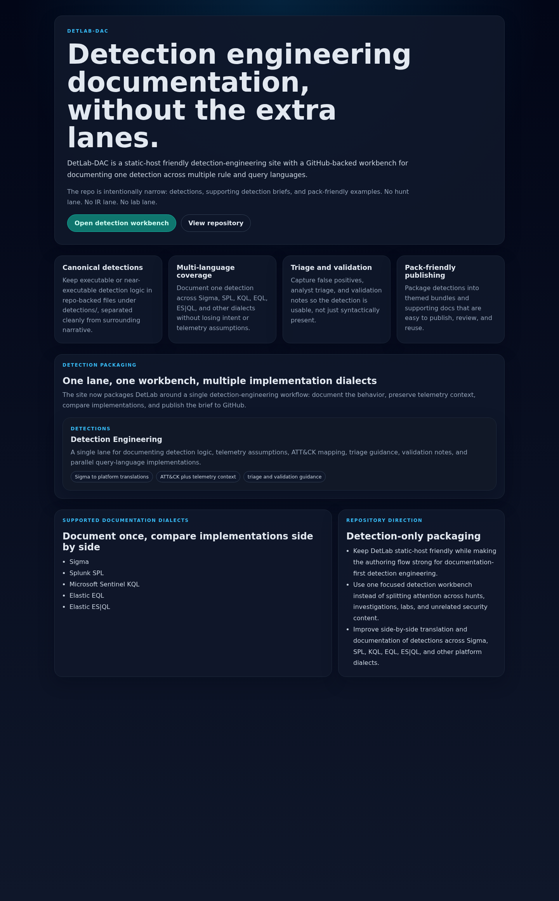
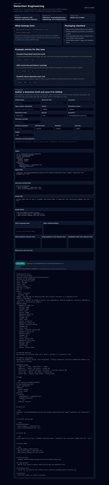

# DetLab-DAC

Documentation-first detection engineering platform for writing, comparing, and publishing a single detection across multiple rule and query languages.



## Project summary

DetLab-DAC packages detection engineering as a **documentation-first workflow**. Instead of starting with one platform query and losing the rest of the context, the project centers a canonical detection brief and maps it to multiple implementations.

The repo currently combines:
- detection content in-repo
- examples and packs
- knowledge-base style documentation
- a static-host-friendly web frontend
- a GitHub-backed authoring workbench for saving detection briefs into the repository

## Start here

| Need | Go to | Why it matters |
| --- | --- | --- |
| Understand the project | this README | Sets the scope: documentation-first detection engineering, not another SIEM |
| Run the web workbench | `web/` | Author and compare canonical detection briefs |
| Review detection content | `detections/` and `examples/` | See how detection ideas are packaged for reuse |
| Study supporting docs | `knowledge/` | Keep telemetry assumptions, ATT&CK mapping, and validation context close to detections |
| Contribute safely | `CONTRIBUTING.md` and `SECURITY.md` | Preserve public-safe examples and consistent detection-writing standards |
| Track direction | `ROADMAP.md` | See where schema, validation, and pack publishing are headed |

## Who it is for

- detection engineers
- SOC analysts and security engineers
- security content authors maintaining cross-platform detections
- teams that want ATT&CK-aware, telemetry-aware detection documentation instead of loose query fragments

## Problem it solves

Detection content often becomes fragmented:
- Sigma in one place
- Splunk SPL in another
- KQL or Elastic queries in notebooks or tickets
- triage notes missing entirely
- telemetry assumptions lost during handoff

DetLab-DAC keeps those pieces together in one detection brief.

## What this is

- a documentation-first detection engineering repository
- a canonical-detection authoring workflow
- a multi-language comparison surface for the same detection idea
- a place to store telemetry assumptions, ATT&CK mapping, triage guidance, and validation notes alongside the rule logic

## What this is not

- not a SIEM product
- not a generic threat-hunting platform
- not an IR case management system
- not a lab automation suite
- not a guarantee that every detection is production-validated in every environment

## Current status

**Active early-stage project.**

What is confirmed in the repository today:
- a Next.js web frontend under `web/`
- a GitHub-backed detection workbench that can render and save markdown artifacts
- canonical detection artifact generation with frontmatter
- side-by-side support for Sigma, Splunk SPL, Microsoft Sentinel KQL, Elastic EQL, and Elastic ES|QL
- repository content areas for detections, examples, knowledge, and reports
- a shared [DetLab Detection Content Specification v1](docs/schema/detection-content-spec-v1.md) adapter with source hashing and generated-artifact provenance
- an optional server-side pySigma conversion API with an explicit backend registry, input limits, timeouts, and structured errors
- workbench conversion controls with loading, error, provenance, and stale-output states
- Node-based tests for web copy/config behavior
- Python contract tests covering every authored detection YAML file

## Features

- **Canonical detection brief** with YAML frontmatter and markdown sections
- **Multi-language implementations** for:
  - Sigma
  - Splunk SPL
  - Microsoft Sentinel KQL
  - Elastic EQL
  - Elastic ES|QL
  - optional additional implementation slot
- **ATT&CK mapping** fields in the detection schema
- **Telemetry assumptions** captured as first-class documentation
- **Triage guidance** and **validation notes** embedded in the artifact format
- **Pack-friendly publishing** through repo-backed markdown output
- **GitHub-backed authoring workflow** in the web workbench (implemented in the repo defaults/config)

## Screenshots / demo

### Landing page


### Detection workbench



## Architecture

```text
detections/                  Detection content
examples/                    Example packs and sample artifacts
knowledge/                   Supporting documentation / authored briefs
reports/                     Generated or review-oriented outputs
scripts/                     Supporting repo scripts
service/                     Optional FastAPI + pySigma conversion service
web/                         Next.js frontend and workbench
  app/                       Routes and pages
  components/                UI components
  data/                      Workbench config and content helpers
  tests/                     Node-based tests
```

## Tech stack

- Next.js 14
- React 18
- TypeScript
- Node built-in test runner (`node --test`)
- Markdown/YAML-based detection artifacts
- GitHub API-backed save flow in the workbench
- FastAPI and pinned pySigma backends for optional server-side conversion

## Quick start

### Web frontend

```bash
cd web
npm install
npm run dev
```

Open `http://localhost:3000`.

### Optional conversion service

```bash
python3 -m venv .venv
. .venv/bin/activate
pip install -r service/requirements.txt
PYTHONPATH=service uvicorn detlab.api:app --host 127.0.0.1 --port 8000
```

Enter `http://localhost:8000` in the workbench conversion panel. See [`service/README.md`](service/README.md) before exposing the API beyond localhost/LAN.

### Repository-level helpers

```bash
make help
```

## Usage

### Example detection workflow

1. define the detection behavior and summary
2. document telemetry prerequisites and field assumptions
3. map ATT&CK tactic/technique
4. add the Sigma version
5. add or compare the SPL, KQL, EQL, and ES|QL implementations
6. add false positives, triage guidance, and validation notes
7. save the artifact into the repo-backed target directory
8. review it as markdown like any other pull-requested content

## Example folder structure

```text
knowledge/
  detection-engineering/
detections/
examples/
  packs/
web/
  app/
  components/
  data/
  tests/
```

## Project structure

The repository separates authored security content from the authoring interface:
- `detections/` for detection artifacts and related content
- `knowledge/` for detection-engineering documentation
- `examples/` for pack-oriented examples
- `web/` for the user-facing authoring and presentation layer

## Testing

### Web tests

```bash
cd web
npm install
npm test
npm run build
```

Current confirmed tests include:
- `tests/site-content.test.mjs`
- `tests/site-copy.test.mjs`
- `tests/workbench-config.test.mjs`

## Deployment

The web app is built as a static-host-friendly Next.js site.

Typical deployment flow:

```bash
cd web
npm install
npm run build
npm run start
```

`npm run start` serves the exported `out/` directory with Python's simple HTTP server.

## Roadmap

See [ROADMAP.md](ROADMAP.md).

### Toward v0.1
- stabilize the detection document schema
- tighten the GitHub-backed authoring and save flow
- expand example detection packs
- improve README/docs consistency across content areas

### Toward v1.0
- broaden canonical detection templates and validation guidance
- strengthen pack publishing and review workflows
- add more opinionated contributor guidance for multi-platform detection authoring
- improve content discovery and comparison UX

## Contributing

See [CONTRIBUTING.md](CONTRIBUTING.md).

## Security

See [SECURITY.md](SECURITY.md).

## License

This repository includes a [LICENSE](LICENSE) file.
