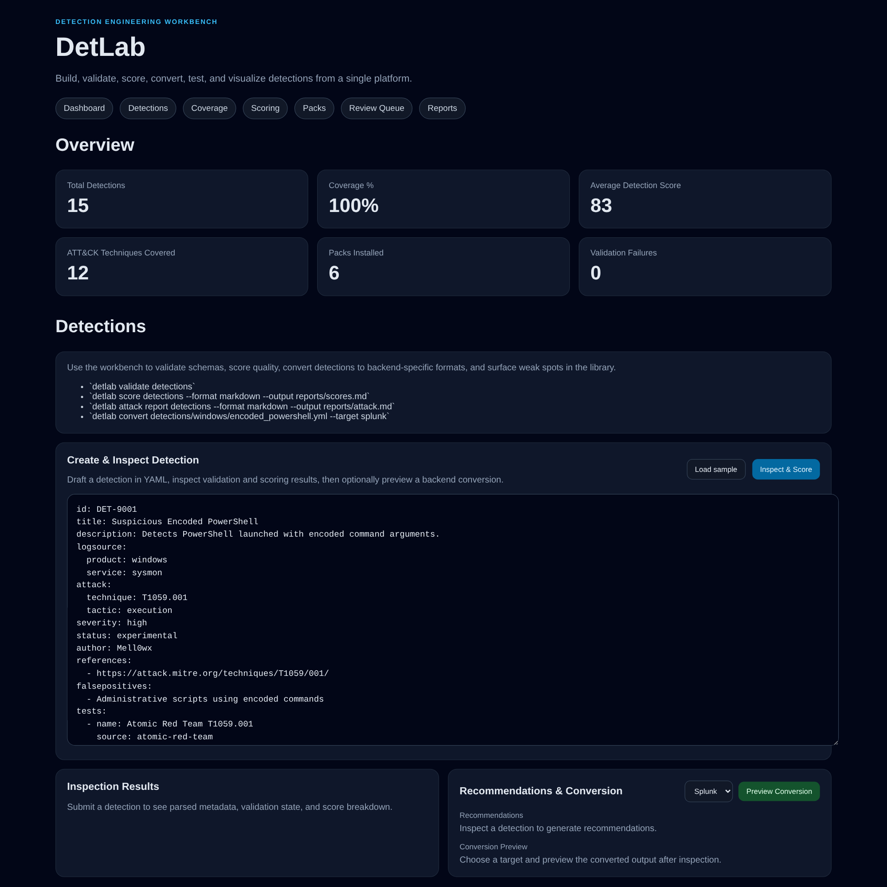
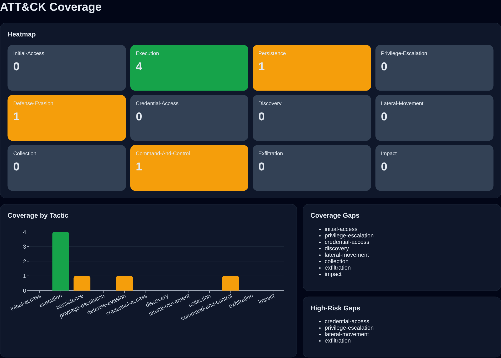
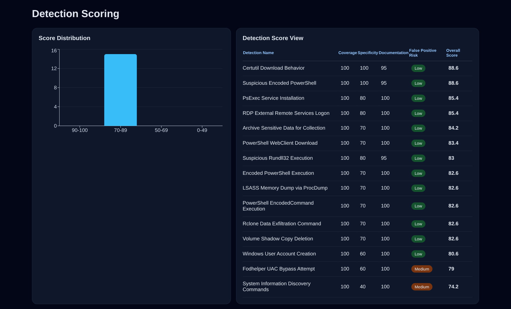
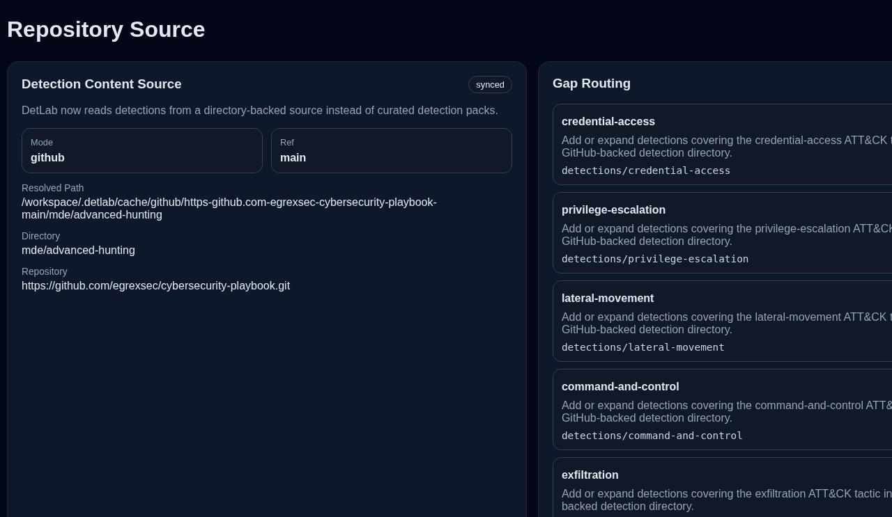
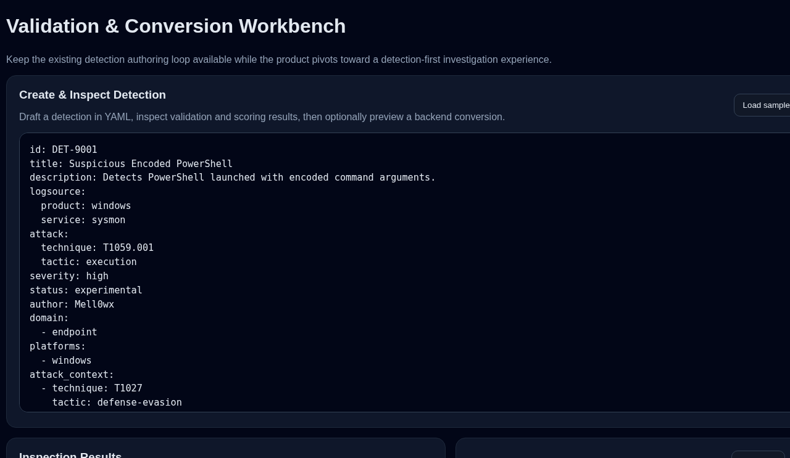
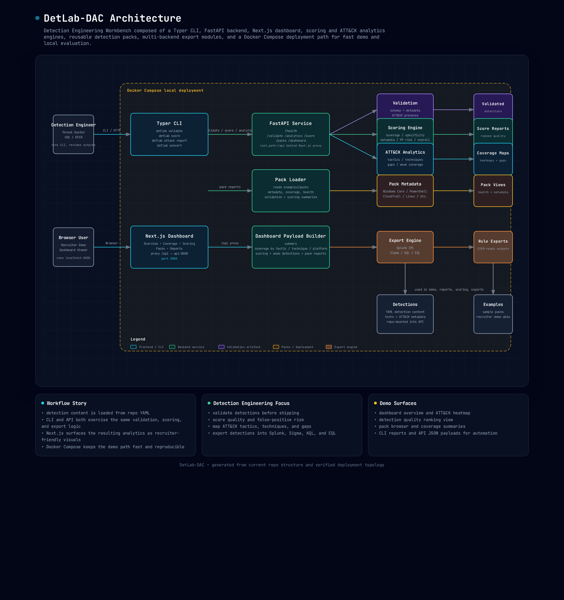

# DetLab

Build, validate, score, convert, test, visually explore, and document detections and investigations from a single platform.

DetLab is evolving from a detection workbench into a detection-first knowledge platform for:
- detection engineering
- threat hunting
- cloud investigations
- incident response case studies
- learning paths and labs

It combines a Python CLI, FastAPI backend, and Next.js UI so you can move from raw detection content into:
- validation
- ATT&CK context
- investigation guidance
- scoring
- backend conversion
- reusable documentation

## Core capabilities

- Validate detections against the DetLab canonical schema
- Score detections for coverage, specificity, maintainability, metadata quality, and false-positive risk
- Convert canonical detections into Splunk SPL, Sigma, Microsoft Sentinel KQL, and Elastic EQL
- Generate ATT&CK coverage analytics and weak-signal summaries
- Browse a detection-first workspace with relationships, response actions, artifacts, and telemetry context
- Author and inspect detections, investigations, threat hunts, and learning artifacts through a single workbench
- Sync a GitHub-backed content source into the active workspace for exploration

## CLI examples

```bash
detlab validate detections/windows/encoded_powershell.yml
detlab score detections --format markdown --output reports/scores.md
detlab attack report detections --format markdown --output reports/attack-coverage.md
detlab convert detections/windows/encoded_powershell.yml --target splunk --output exports/encoded_powershell.spl
```

## API examples

- `GET /api/detections/catalog`
- `GET /api/detections/{detection_id}/workspace`
- `GET /api/schema/domain`
- `POST /api/detections/inspect`
- `POST /api/detections/convert`

## Screenshots

Captured on 2026-06-20 from the verified local FastAPI + Next.js workflow in this repository against the default GitHub-backed source (`egrexsec/cybersecurity-playbook` → `mde/advanced-hunting`).

### 1. Detection Workspace Overview

Top-level workspace view with the detection catalog, selected detection context, query, and investigation guidance.



### 2. ATT&CK Heat Map

Technique-context view showing direct coverage, partial coverage, related activity, and visible gaps for the selected detection.



### 3. Score Review

Library-level scoring summary with distribution and per-detection quality breakdown.



### 4. Repository Source

GitHub-backed source metadata and sync history for the active markdown detection library.



### 5. Validation & Conversion Workbench

In-browser authoring flow for validating detections, inspecting results, and previewing backend conversions.



## Architecture

DetLab is evolving from a pure detection engineering workbench into a detection-first investigation platform with a fast local demo path and a workflow that maps cleanly to real SOC engineering tasks.



Architecture highlights:
- **Typer CLI** for validation, scoring, ATT&CK reporting, and backend export workflows
- **FastAPI** for health, validation, scoring, analytics, domain schema, detection catalog, workspace, source, and dashboard APIs
- **Next.js application** for a detection-first catalog, investigation workspace, ATT&CK heat-map context, quality views, and authoring workbench flows
- **Detection domain schema** for investigation steps, artifacts, cloud telemetry, related detections, and response actions
- **Scoring engine** for coverage, specificity, metadata, maintainability, and false-positive risk calculations
- **ATT&CK analytics** for tactic/technique coverage, weak coverage, and high-risk gaps
- **Export engine** for Splunk SPL, Sigma, Sentinel KQL, and Elastic EQL outputs
- **GitHub-backed source sync** for pulling a repo directory into the active analysis workspace
- **Local run scripts** for one-command startup without containers

For the editable source diagram, see `docs/architecture-diagram.html`.

## Quick Start

### Requirements
- `uv`
- Node.js + npm
- GNU Make

### One-command startup

```bash
git clone https://github.com/egrexsec/DetLab-DAC.git
cd DetLab-DAC
cp .env.example .env
make up
```

Open:
- `http://127.0.0.1:3000`

### What starts
- `api` → FastAPI backend on `127.0.0.1:8000`
- `web` → Next.js workbench UI on `127.0.0.1:3000`

### Useful commands

```bash
make ps
make logs
make down
make test
make web-build
```

### Manual startup

```bash
uv sync
uv run uvicorn detlab.api:app --host 127.0.0.1 --port 8000

cd web
npm install
npm test
npm run build
npm run dev -- --hostname 127.0.0.1 --port 3000
```

The web app defaults its internal `/api` proxy target to `http://127.0.0.1:8000` for local runs.

### Environment defaults

`.env.example` includes:
- `DETLAB_ROOT_PATH=/api`
- `NEXT_PUBLIC_API_BASE_URL=/api`
- `DETLAB_SOURCE_REPO=egrexsec/cybersecurity-playbook`
- `DETLAB_SOURCE_REF=main`
- `DETLAB_SOURCE_SUBDIR=mde/advanced-hunting`

The `/api` root path keeps FastAPI docs and OpenAPI working correctly when the web app proxies local requests.
The GitHub source settings tell the API which repo directory to sync into the active analysis workspace.

## Example Workflow

1. Create or import a detection
2. Validate the detection
3. Score the detection quality
4. Generate an ATT&CK coverage report
5. Convert the detection for a target backend

```bash
detlab validate detections/windows/encoded_powershell.yml
detlab score detections --format markdown --output reports/scores.md
detlab attack report detections --format markdown --output reports/attack-coverage.md
detlab convert detections/windows/encoded_powershell.yml --target splunk --output exports/encoded_powershell.spl
```

### Browser workflow

1. Open `http://127.0.0.1:3000`
2. Use the catalog tabs to pivot between **Detections**, **Investigations**, **Threat Hunts**, and **Learning Paths**
3. Open **Workbench**
4. Load or paste content for the lane you want to author
5. Click **Inspect & Score** to validate and score it
6. Choose `Splunk`, `Sigma`, `KQL`, or `EQL`
7. Click **Preview Conversion** to render backend output in-place

## Sample Detection Packs

- `detections/windows/`
- `detections/linux/`
- `detections/cloud/`

## Knowledge Lanes

- `knowledge/detection-engineering/`
- `knowledge/threat-hunts/`
- `knowledge/incident-response-case-studies/`
- `knowledge/learning-paths/`
- `knowledge/labs/`
- `knowledge/aws-security-learning/`
- `knowledge/flaws-cloud/`
- `knowledge/flaws2-cloud/`

## Why this matters

DetLab is designed so that:
- detections are validated
- detections are scored
- ATT&CK coverage is visible
- backend conversion exists
- packs make the project easy to demo and extend
- documentation becomes part of the deliverable, not an afterthought

A detection engineer should understand the core workflow in under 2 minutes.
A new user should be able to boot the local stack in under 5 minutes with `make up`.
